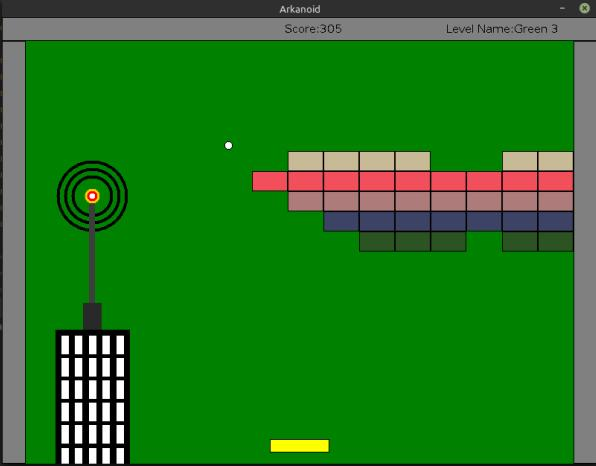

# Arknoid Game
A semester long project in Java as part of Object Oriented Programming course in BIU.
It uses an implementation of GUI provided by the course staff and it is not using the built-in GUI objects of java.

## Requirements:
* You must have Java SE 11 or higher installed on your machine. 

## Compiling and running the app

You can either download the game directly [here](Logistic/) and start playing, or you can download the entire project, compile and run it on your machine.

If you're running the project on your machine, make sure you download the biuoop-1.4.jar file (can be downloaded [here](Logistic/))

Enjoy :)

